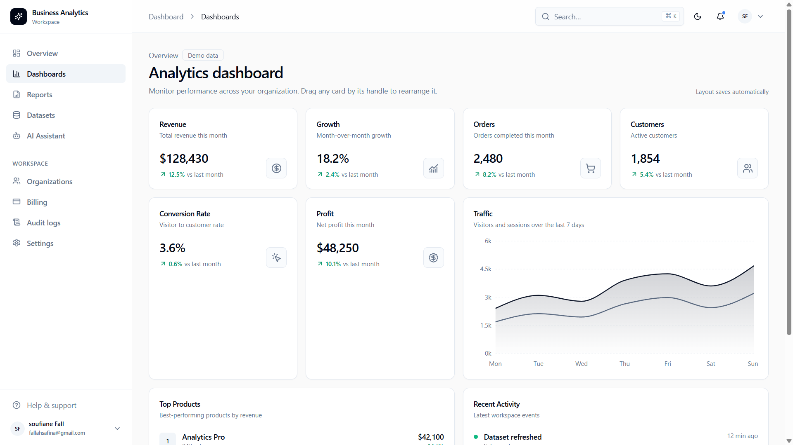
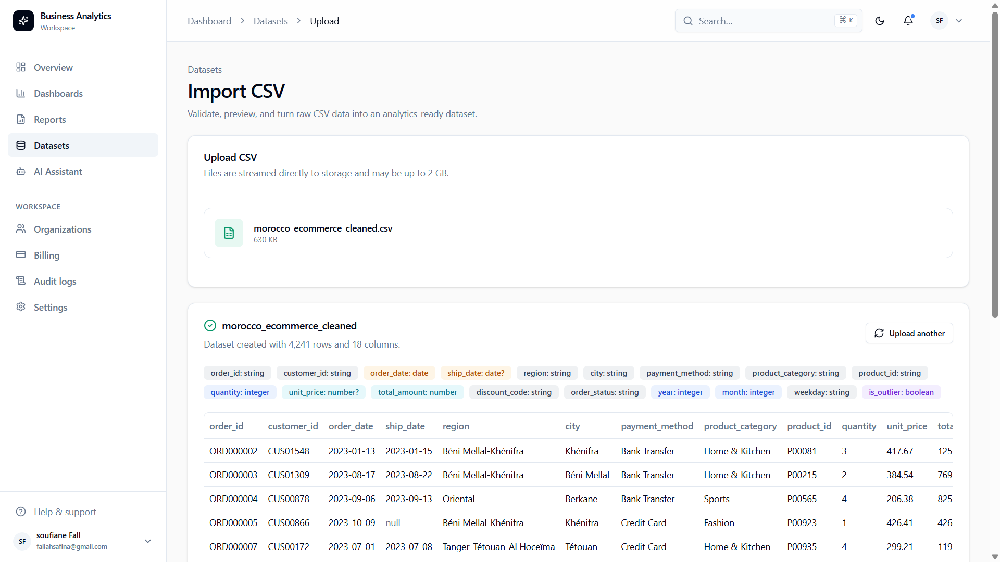
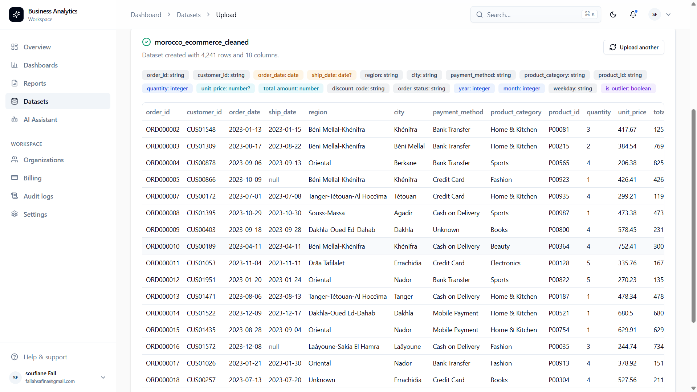
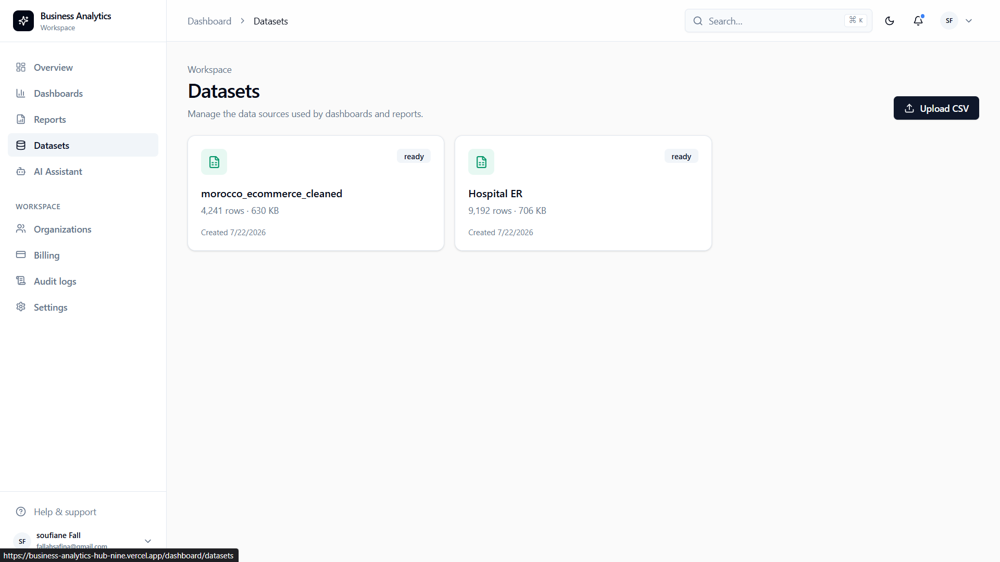
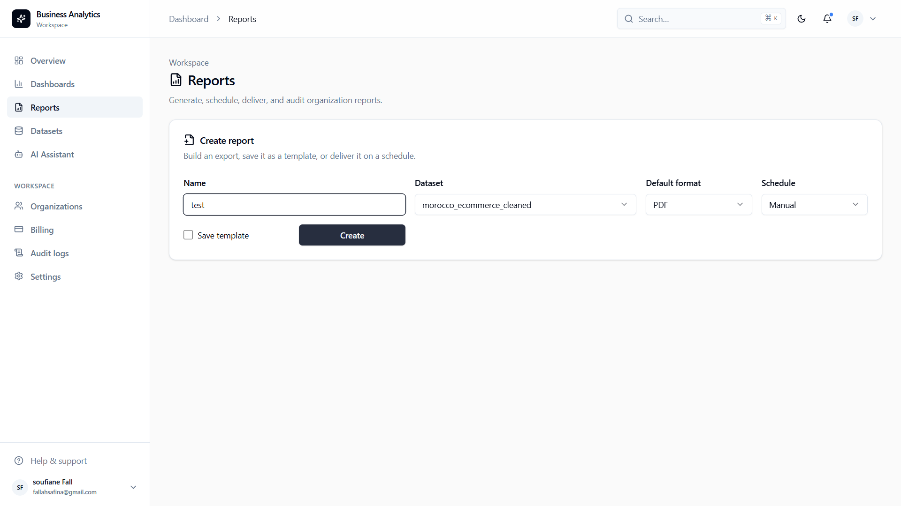
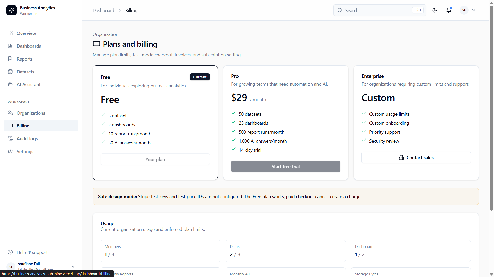

# Business Analytics Hub

Business Analytics Hub is a multi-tenant SaaS for turning operational data into governed datasets, analytics dashboards, scheduled reports, and AI-assisted business insights. It combines a modern Next.js interface with organization-scoped authorization, PostgreSQL persistence, auditable workflows, and production deployment tooling.

[Live production test](https://business-analytics-hub-nine.vercel.app) · [Architecture](docs/architecture.md) · [Deployment guide](docs/deployment.md)

> The hosted instance is a production-like test environment. Email delivery, paid Stripe checkout, persistent object storage, Redis, Sentry, and hosted Ollama are intentionally not enabled there yet.

## Product tour

### Analytics dashboards

Track revenue, growth, orders, customers, conversion rate, profit, traffic, top products, and recent activity from a responsive organization dashboard. Widgets are reusable, draggable, and their layout is persisted per organization.



### CSV ingestion and type inference

Upload CSV files through a streamed ingestion pipeline. The application checks file size and content, calculates a checksum, validates row consistency, infers column types, detects nullable fields, and creates a queryable dataset.



The preview makes inferred types and representative rows visible before the data is used for analytics.



### Dataset catalog

Datasets are scoped to the active organization and show processing status, row count, file size, and creation time. The dataset query engine supports searching, filtering, sorting, pagination, column selection, grouping, aggregation, and date filters.



### Report generation

Create reports from organization datasets, choose PDF, Excel, or CSV output, save report templates, run reports manually, or schedule recurring delivery. Report runs and exports are recorded for auditing.



### Plans, limits, and billing

The billing module models Free, Pro, and Enterprise plans and enforces limits for members, datasets, dashboards, report runs, AI answers, and storage. Stripe checkout, customer portal, trials, upgrades, downgrades, cancellation, and invoices are supported when test or production Stripe credentials are configured.



## Core capabilities

- **Organizations and RBAC** — users can belong to multiple organizations, switch workspaces, invite members, leave organizations, and manage owner, admin, manager, analyst, and viewer roles.
- **Protected APIs** — organization permissions are checked server-side for every scoped operation.
- **Authentication** — Better Auth provides registration, login, sessions, email verification, forgot/reset password flows, and organization integration.
- **Dataset engine** — PostgreSQL-backed filtering, sorting, searching, pagination, grouping, aggregation, date filtering, and cached queries.
- **Charts** — reusable responsive Recharts components for line, area, bar, pie, donut, radar, scatter, heatmap, funnel, and treemap visualizations, including PNG export states.
- **AI insights** — a provider-independent `AIService` abstraction with Ollama as the default provider. Business statistics are calculated by the application; the model only turns supplied evidence into natural-language insights.
- **AI assistant** — organization-scoped conversations, streaming responses, persisted history, suggested follow-ups, context limits, caching, and guardrails against unrelated or unsupported answers.
- **Audit logging** — searchable records for authentication, CRUD actions, role and organization changes, uploads, exports, billing, reports, and AI usage.
- **Administration** — platform-level views for users, organizations, subscriptions, AI usage, reports, audit records, health, KPIs, and charts.
- **Accessible design system** — reusable shadcn/ui primitives, keyboard-friendly controls, loading skeletons, error states, empty states, responsive navigation, and dark mode.

## Architecture

The application uses a feature-based Clean Architecture structure:

```text
src/
├── app/                       # Next.js routes, layouts, API endpoints
├── components/                # Shared UI primitives and providers
├── features/
│   ├── admin/
│   ├── ai-assistant/
│   ├── ai-insights/
│   ├── audit/
│   ├── auth/
│   ├── billing/
│   ├── charts/
│   ├── dashboards/
│   ├── datasets/
│   ├── organizations/
│   └── reports/
└── lib/                       # Database, cache, email, auth, environment, logging
```

Feature modules separate domain types, application services, infrastructure adapters, schemas, server authorization, and UI components. Server Components are the default; Client Components are limited to interactive boundaries.

More detail is available in [architecture.md](docs/architecture.md), [folder-structure.md](docs/folder-structure.md), and [conventions.md](docs/conventions.md).

## Technology stack

| Area                 | Technology                                             |
| -------------------- | ------------------------------------------------------ |
| Web                  | Next.js 15 App Router, React 19, TypeScript            |
| UI                   | Tailwind CSS, shadcn/ui, Radix UI, Recharts, dnd-kit   |
| Data                 | PostgreSQL, Prisma ORM, Redis-compatible cache         |
| Authentication       | Better Auth                                            |
| Validation and forms | Zod, React Hook Form                                   |
| Billing              | Stripe                                                 |
| AI                   | Ollama with provider factory and streaming             |
| Testing              | Vitest, V8 coverage, Playwright                        |
| Operations           | Docker, Docker Compose, GitHub Actions, Vercel, Sentry |

## Run locally

### Prerequisites

- Node.js 22
- PostgreSQL
- Optional: Redis and Ollama with `llama3.2`

### Setup

```bash
git clone https://github.com/soufianfallah/Business-Analytics-Hub.git
cd Business-Analytics-Hub
npm ci
```

Copy `.env.example` to `.env`, replace its placeholders, and never commit the resulting file. Then apply the schema and start the development server:

```bash
npm run db:deploy
npm run dev
```

Open [http://localhost:3000](http://localhost:3000).

For local development with a new migration, use `npm run db:migrate`. Production and CI use `npm run db:deploy` to apply committed migrations without creating new ones.

## Environment configuration

The complete inventory and safe examples live in [.env.example](.env.example). Important groups are:

- application URLs and Better Auth secret;
- pooled and direct PostgreSQL URLs;
- SMTP sender configuration;
- upload storage path and scheduled-report secret;
- Ollama provider, model, timeout, retry, and cache settings;
- optional Redis, Stripe, Sentry, and platform-admin settings.

Generate secrets locally rather than sharing them in chat or source control:

```bash
node -e "console.log(require('crypto').randomBytes(32).toString('base64'))"
```

## Testing and quality

```bash
npm run typecheck
npm run lint
npm run test:unit
npm run test:integration
npm run test:coverage
npm run test:e2e
```

The coverage suite enforces at least 90% across its declared production-module scope. The current suite contains unit tests, mocked-Prisma integration tests, a deterministic mock AI provider, and Playwright authentication/route-protection checks.

## Deployment

### Vercel and Neon

The hosted test deployment uses Vercel for Next.js and Neon for PostgreSQL. Production variables are configured in Vercel, and Prisma migrations are applied through a release step before deployment.

### Docker Compose

The repository also contains a multi-stage `Dockerfile` and a Compose stack with:

- the standalone Next.js application;
- PostgreSQL with a readiness check and persistent volume;
- Redis with append-only persistence;
- a one-shot Prisma migration service;
- persistent upload storage.

```bash
docker compose build
docker compose up -d
```

See [deployment.md](docs/deployment.md) for environment setup, backups, migration strategy, health checks, logging, monitoring, Sentry, Vercel, and Docker operations.

## Operational endpoints

- `GET /api/health/live` — confirms the application process responds.
- `GET /api/health/ready` — verifies PostgreSQL and reports the active cache layer.
- `GET /api/jobs/reports` — Vercel-compatible scheduled report worker protected by `CRON_SECRET`.

## Current hosted-test limitations

- SMTP is disabled, so the hosted test does not send verification, invitation, or password-reset email.
- Ollama requires a separately hosted private endpoint; it cannot run inside Vercel Functions.
- Vercel's filesystem is ephemeral. Durable CSV/report object storage is required before accepting production customer files.
- Redis and Sentry are optional and currently unset on the public test deployment.
- Stripe is in safe design mode until valid test keys, webhook secret, and price IDs are configured.

## License

No open-source license has been granted yet. All rights are reserved by the project owner.
